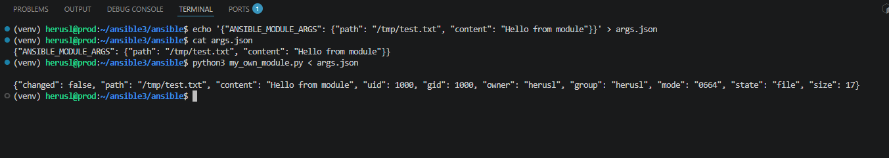
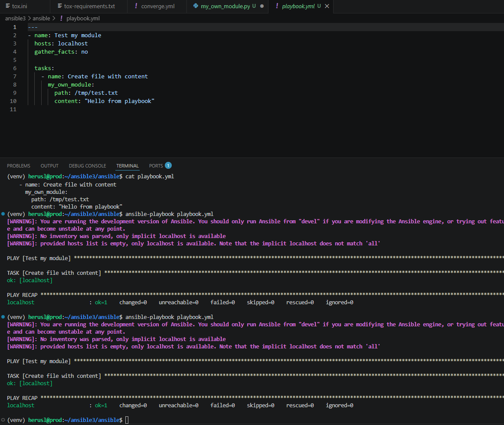
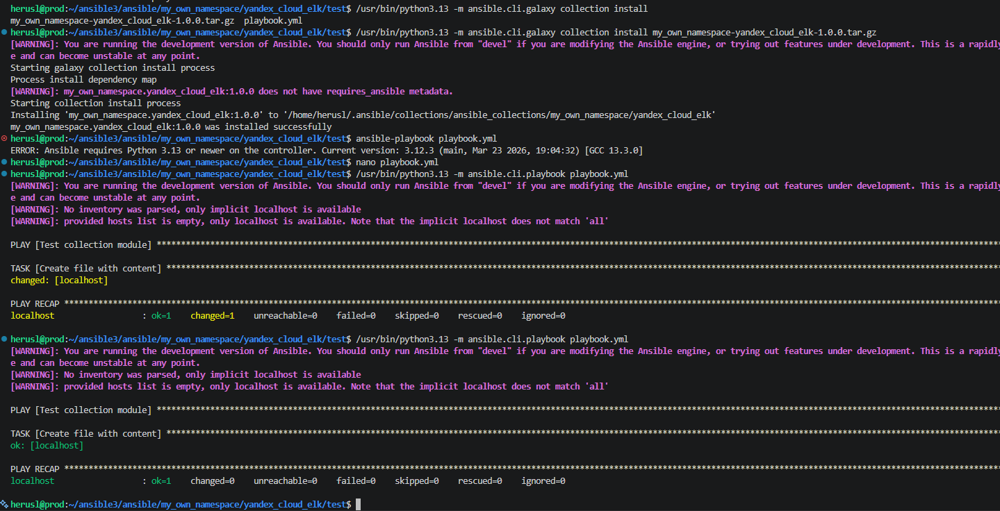

# Ansible Collection - my_own_namespace.yandex_cloud_elk

Documentation for the collection.
# My Own Collection

## Description
Коллекция создает файл по указанному пути

## Modules
- **my_own_module** - Создает файл по указанному пути

## Roles
- **create_file** - Роль для создания файла

## Usage
```yaml
- name: Create file
  my_own_namespace.yandex_cloud_elk.my_own_module:
    path: /tmp/file.txt
    content: "Hello"
```

Скриншоты к заданиям:



